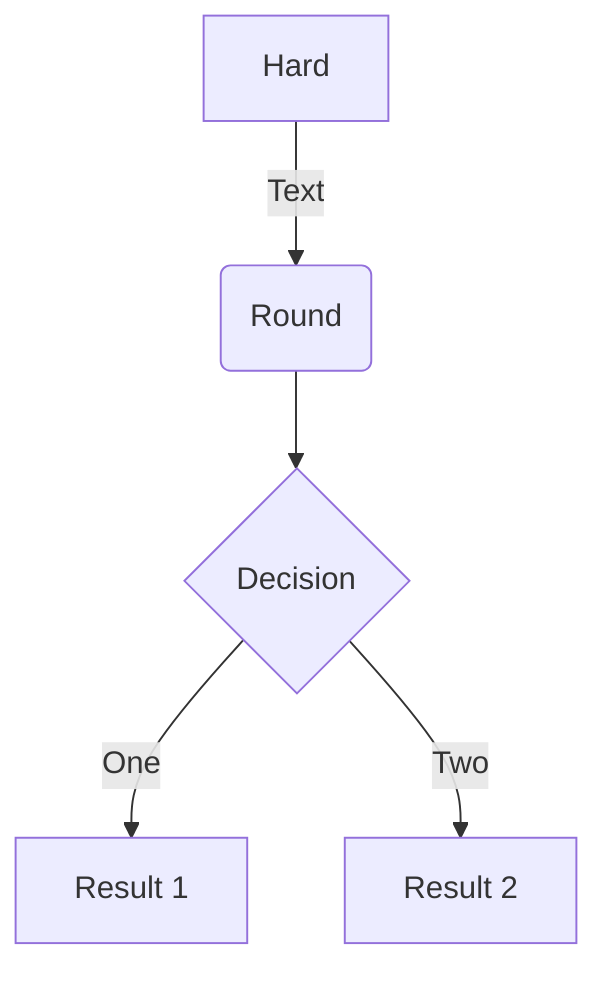
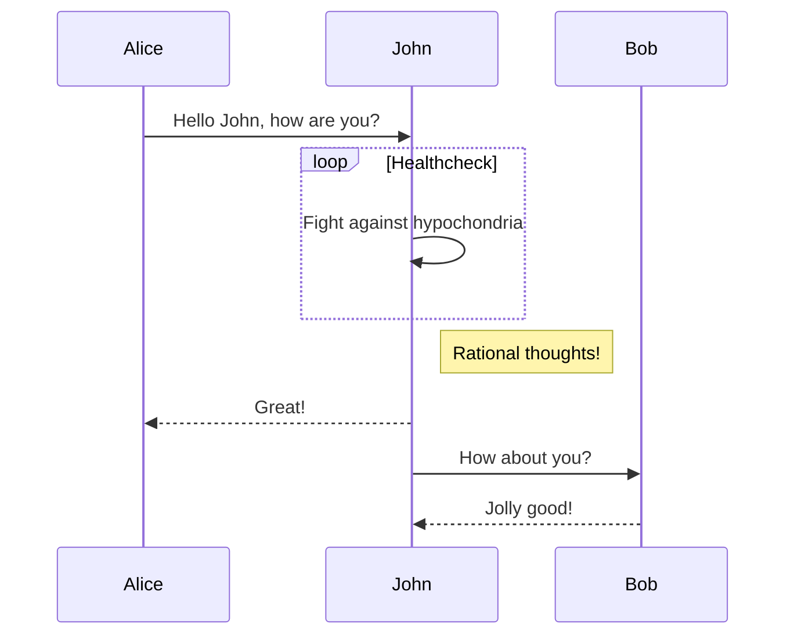
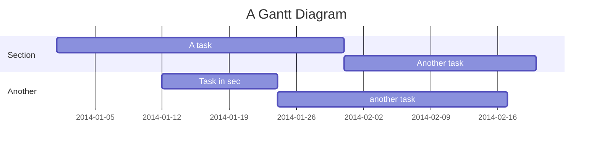
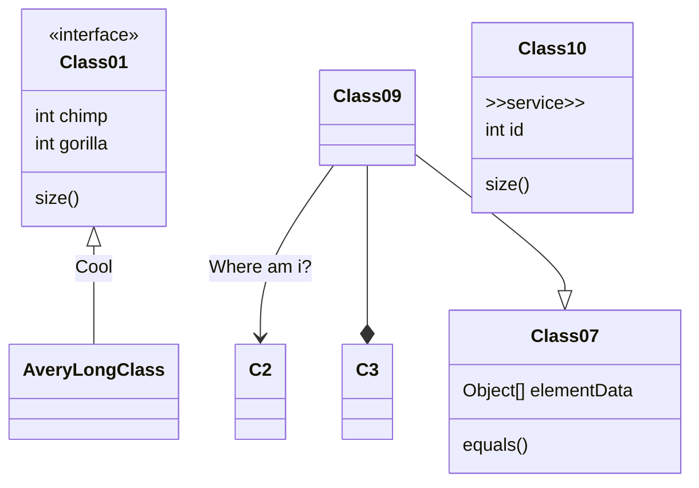
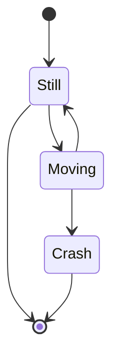
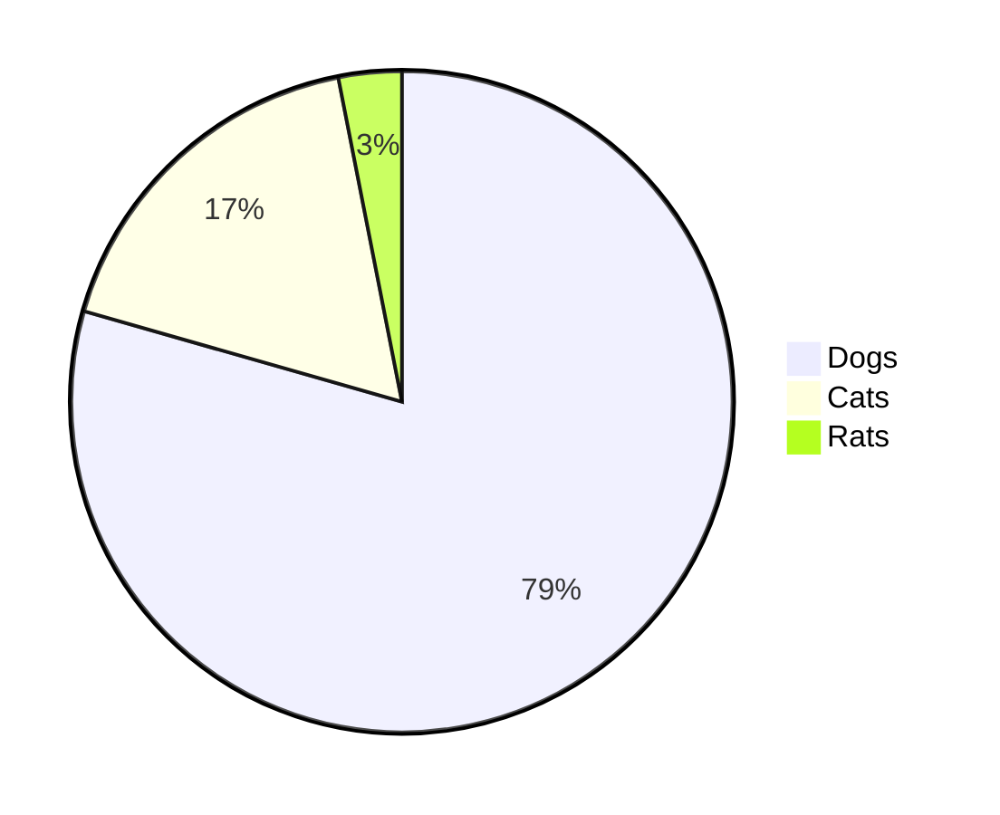
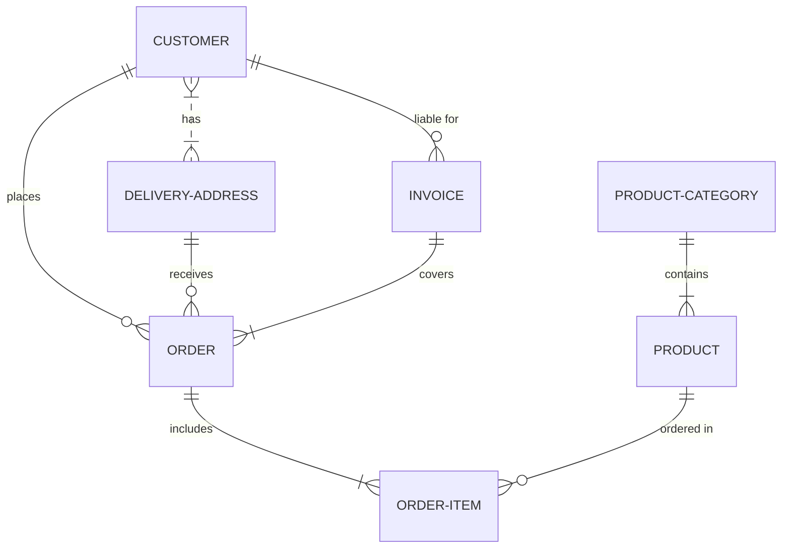

# Features
## List
- [x] Markdown Basics  
    - [x] Headers
    - [x] Emphasis
    - [x] Lists
        - [x] Unordered List
        - [x] Ordered List
    - [x] Images
    - [x] Links
    - [x] Blockquote
    - [x] Horizontal Rule
    - [x] Inline code
    - [x] Code block
- [x] Extended Markdown Basics
    - [x] Tables
    - [x] Strikethrough
- [ ] Mume Specific Markdown Basics
    - [x] `id` and `class` css selector support for headers
    - [ ] `class` css selector for code blocks
    - [x] Code block line numbers
    - [x] Code block highlighting rows
    - [x] Task Lists
    - [ ] Table colspan with `>`, rowspan with `^`
    - [ ] Emoji
    - [ ] Font-Awesome
    - [x] Superscript
    - [x] Subscript
    - [x] Footnotes
    - [x] Abbreviation
    - [ ] Mark
    - [ ] CriticMarkup
- [ ] Math
    - [ ] LaTeX Support with [MathJax](https://www.mathjax.org/)
- [ ] Diagrams
    - [ ] Flowchart support with [flowchart.js](https://flowchart.js.org/)
    - [x] [Mermaid](https://github.com/knsv/mermaid) Library
    - [ ] Digital Timing diagram with [WaveDrom](https://wavedrom.com/) 
- [x] Table of Contents Generation
- [ ] Circuit Schematics with TikZ

Sequence Diagrams with [js-sequence-diagrams](https://bramp.github.io/js-sequence-diagrams/) will not be implemented, 
since [mermaid](https://github.com/knsv/mermaid) supports more powerful sequence diagram rendering. 

## Test area
Test for **Extended Grammar only**  

### Custom id Header {#custom-id}
This Header should be displayed as `Custom id Header`, not `Custom id Header {#custom-id}`

### `class` css selector for code blocks
```javascript {.class1}
const text = "TEXT";
```

### Fenced Text Block
```
Test
```

### Code Block Test with 한글
```javascript
// Test for Comments
/*
 * Long Comment
 */
const data = "한글/English/Test";
const parsed = data.split('/').filter(e => e);
console.log(parsed);
```

### Code Block Line Numbers
```javascript{numberLines: true}
const num = 10;
let sum = 0;
for (let i = 1; i <= num; ++i) {
    sum += i;
}
```

### Code Block Highlighting Rows
```javascript
const num = 10;
let sum = 0;
for (let i = 1; i <= num; ++i) { // highlight-line
    sum += i;
}
```

### Abbreviation
The HTML specification
is maintained by the W3C.
 
*[HTML]: Hyper Text Markup Language
*[W3C]:  World Wide Web Consortium

### Superscript
This is Plaintext. ^This is Superscript^

### SubScript
This is Plaintext. ~This is Subscript~

### Emojis
:thinking:

### Attributes
[Gatsby](https://github.com/gatsbyjs/gatsby){rel="customize"}

### Footnotes
Footnote Test [^Footnote]

### Mermaid
#### Flow


#### Sequence


#### Gantt


#### Class


#### State


#### Pie


#### ER


#### Git


### Video
`video: https://www.youtube.com/embed/2Xc9gXyf2G4`

### MathJax
$a^2 + b^2 = c^2$

$$
a^2 + b^2 = c^2
$$

근의 공식 :   
> $$x = {-b \pm \sqrt{b^2-4ac} \over 2a}$$

## Package Management
- [x] gatsby-remark-abbr
- [x] gatsby-remark-attr
- [x] gatsby-remark-autolink-headers
- [ ] gatsby-remark-copy-linked-files
- [x] gatsby-remark-embed-video
- [ ] gatsby-remark-external-links
- [x] gatsby-remark-footnotes
- [x] gatsby-remark-mathjax-ssr
- [x] gatsby-remark-mermaid
- [ ] gatsby-remark-normalize-paths
- [x] gatsby-remark-prismjs
- [ ] gatsby-remark-relative-images
- [x] gatsby-remark-sub-sup
- [ ] gatsby-remark-twemoji-shortcut
  

[^Footnote]: Test
    
